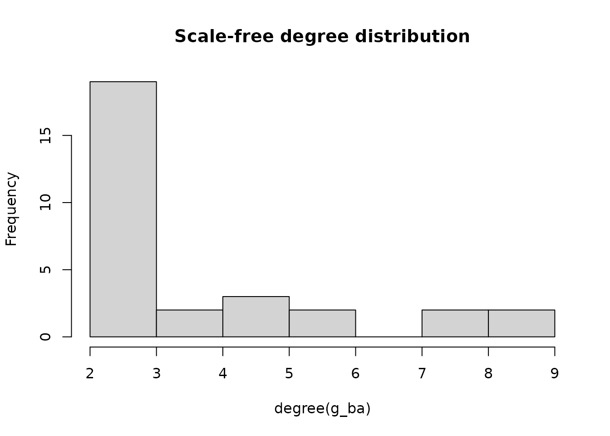

# Complete Simulation Guide

``` r

library(Saqrlab)
#> 
#> Attaching package: 'Saqrlab'
#> The following object is masked from 'package:stats':
#> 
#>     simulate
```

## Overview

This guide covers all simulation functions in Saqrlab. The package
provides multiple ways to generate synthetic data for Temporal Network
Analysis:

### Network Objects

| Function | Output | Use Case |
|----|----|----|
| [`simulate_igraph()`](https://pak.dynasite.org/Saqrlab/reference/simulate_igraph.md) | igraph object | Network analysis with igraph |
| [`simulate_network()`](https://pak.dynasite.org/Saqrlab/reference/simulate_network.md) | statnet network | SNA with sna/network packages |
| [`simulate_tna_network()`](https://pak.dynasite.org/Saqrlab/reference/simulate_tna_network.md) | Fitted tna model | Ready-to-use TNA model |

### Matrices & Sequences

| Function | Output | Use Case |
|----|----|----|
| [`simulate_matrix()`](https://pak.dynasite.org/Saqrlab/reference/simulate_matrix.md) | Transition matrix | Simple networks |
| [`simulate_htna()`](https://pak.dynasite.org/Saqrlab/reference/simulate_htna.md) | Multi-type matrix | HTNA/MLNA analysis |
| [`simulate_sequences()`](https://pak.dynasite.org/Saqrlab/reference/simulate_sequences.md) | Wide-format sequences | Basic TNA |
| [`simulate_sequences_advanced()`](https://pak.dynasite.org/Saqrlab/reference/simulate_sequences_advanced.md) | Sequences with patterns | Realistic simulations |

### Hierarchical & Social Data

| Function | Output | Use Case |
|----|----|----|
| [`simulate_long_data()`](https://pak.dynasite.org/Saqrlab/reference/simulate_long_data.md) | Hierarchical long format | Group/course analysis |
| [`simulate_onehot_data()`](https://pak.dynasite.org/Saqrlab/reference/simulate_onehot_data.md) | One-hot encoded data | ML applications |
| [`simulate_edge_list()`](https://pak.dynasite.org/Saqrlab/reference/simulate_edge_list.md) | Edge list | Social networks |

## Simulating Network Objects

### igraph Networks with `simulate_igraph()`

Generate igraph objects using common graph algorithms. Perfect for
network analysis, visualization, and teaching.

``` r

library(igraph)
#> 
#> Attaching package: 'igraph'
#> The following objects are masked from 'package:stats':
#> 
#>     decompose, spectrum
#> The following object is masked from 'package:base':
#> 
#>     union

# Default: random Erdos-Renyi network (20-50 nodes)
g <- simulate_igraph(seed = 42)
vcount(g)
#> [1] 36
V(g)$name[1:10]  # Human names from diverse regions
#>  [1] "Hassan"  "Bao"     "Sophie"  "Rebecca" "Abdi"    "Somsak"  "Kai"    
#>  [8] "Ramesh"  "Jawad"   "Ondrej"
```

#### Graph Algorithms

``` r

# Scale-free network (Barabasi-Albert)
g_ba <- simulate_igraph(n = 30, model = "ba", m_ba = 2, seed = 42)
hist(degree(g_ba), main = "Scale-free degree distribution")
```



``` r


# Small-world network (Watts-Strogatz)
g_ws <- simulate_igraph(n = 30, model = "ws", nei = 3, p_rewire = 0.1, seed = 42)

# Community structure (Stochastic Block Model)
g_sbm <- simulate_igraph(n = 30, model = "sbm", blocks = 3, seed = 42)
V(g_sbm)$block  # Block assignments
#>  [1] 1 1 1 1 1 1 1 1 1 1 2 2 2 2 2 2 2 2 2 2 3 3 3 3 3 3 3 3 3 3
```

#### Choosing Name Regions

``` r

# Names from specific regions
g_arab <- simulate_igraph(n = 15, regions = "arab", seed = 42)
V(g_arab)$name
#>  [1] "Amr"    "Faisal" "Salma"  "Dalal"  "Noor"   "Heba"   "Layla"  "Hana"  
#>  [9] "Amira"  "Khaled" "Dina"   "Yusuf"  "Rami"   "Mona"   "Rana"

# Names from a continent
g_africa <- simulate_igraph(n = 15, regions = "africa", seed = 42)
V(g_africa)$name
#>  [1] "Kwadwo"  "Palesa"  "Farai"   "Aminata" "Mpho"    "Akua"    "Zuri"   
#>  [8] "Solange" "Tapiwa"  "Fartun"  "Makeda"  "Sihem"   "Ngozi"   "Sylvie" 
#> [15] "Yassine"

# Multiple regions
g_asia <- simulate_igraph(n = 15, regions = c("east_asia", "south_asia"), seed = 42)
V(g_asia)$name
#>  [1] "Ryu"       "Chitra"    "Imran"     "Kenta"     "Karthik"   "Sakura"   
#>  [7] "Tae"       "Senthil"   "Maya"      "Ganzorig"  "Mei"       "Iqbal"    
#> [13] "Oyunbileg" "Tahera"    "Hamza"

# Learning states instead of human names
g_states <- simulate_igraph(n = 10, name_source = "states", seed = 42)
V(g_states)$name
#>  [1] "Evaluate"   "Consult"    "Anxious"    "Regulate"   "Respond"   
#>  [6] "Integrate"  "Apply"      "Note"       "Doubt"      "Brainstorm"
```

#### Weighted Networks

``` r

# Add random edge weights
g_w <- simulate_igraph(n = 20, weighted = TRUE, seed = 42)
E(g_w)$weight[1:10]
#>  [1] 0.5074584 0.5822110 0.5836390 0.1012428 0.4200994 0.6509198 0.8460479
#>  [8] 0.4210498 0.4695716 0.6161283
```

### statnet Networks with `simulate_network()`

Generate network objects for use with sna and network packages.

``` r

library(network)
library(sna)

# Default network
net <- simulate_network(seed = 42)
network.size(net)
network.vertex.names(net)[1:10]

# Scale-free for SNA analysis
net_ba <- simulate_network(n = 30, model = "ba", seed = 42)
betweenness(net_ba)
```

### Fitted TNA Models with `simulate_tna_network()`

The simplest way to get a ready-to-use TNA model:

``` r

# Generate a fitted tna model
model <- simulate_tna_network(seed = 42)
class(model)  # "tna"

# Use with tna functions
library(tna)
plot(model)
centralities(model)
communities(model)

# Custom configuration
model <- simulate_tna_network(
  n_states = 8,
  n_sequences = 500,
  categories = "group_regulation",
  seed = 123
)
```

## Simulating Transition Matrices

### Simple Matrices with `simulate_matrix()`

Generate a basic transition matrix where each row sums to 1:

``` r

# Default: 9-node transition matrix
mat <- simulate_matrix(seed = 42)
dim(mat)
#> [1] 9 9
rowSums(mat)  # All sum to 1
#>   Regulate       Plan      Judge    Reflect    Monitor   Forecast Anticipate 
#>     1.0000     1.0000     0.9999     0.0000     1.0000     1.0000     1.0000 
#>      Check      Adapt 
#>     1.0000     1.0000
```

The function automatically selects learning state names from a random
category:

``` r

rownames(mat)
#> [1] "Regulate"   "Plan"       "Judge"      "Reflect"    "Monitor"   
#> [6] "Forecast"   "Anticipate" "Check"      "Adapt"
```

#### Matrix Types

``` r

# Transition matrix (default) - rows sum to 1
trans_mat <- simulate_matrix(n_nodes = 5, matrix_type = "transition", seed = 42)
rowSums(trans_mat)
#> Regulate     Plan    Judge  Reflect  Monitor 
#>        1        1        1        1        1

# Frequency matrix - integer counts
freq_mat <- simulate_matrix(n_nodes = 5, matrix_type = "frequency", seed = 42)
head(freq_mat)
#>          Regulate Plan Judge Reflect Monitor
#> Regulate        0 6604     0       0       0
#> Plan            0    0  4677       0       0
#> Judge        4802    0     0       0    9890
#> Reflect      8346 5191     0       0       0
#> Monitor      2156    0  9738       0       0

# Co-occurrence matrix - symmetric
cooc_mat <- simulate_matrix(n_nodes = 5, matrix_type = "co-occurrence", seed = 42)
isSymmetric(cooc_mat)
#> [1] TRUE

# Adjacency matrix - binary or weighted
adj_mat <- simulate_matrix(n_nodes = 5, matrix_type = "adjacency",
                           weighted = FALSE, seed = 42)
unique(as.vector(adj_mat))
#> [1] 0 1
```

#### Controlling Edge Density

``` r

# Sparse network (30% edge probability, default)
sparse <- simulate_matrix(n_nodes = 6, edge_prob = 0.3, seed = 42)
sum(sparse > 0) / length(sparse)
#> [1] 0.25

# Dense network (80% edge probability)
dense <- simulate_matrix(n_nodes = 6, edge_prob = 0.8, seed = 42)
sum(dense > 0) / length(dense)
#> [1] 0.7222222
```

#### Custom Node Names

``` r

# Use your own state names
mat <- simulate_matrix(
  n_nodes = 4,
  names = c("Explore", "Learn", "Practice", "Master"),
  seed = 42
)
rownames(mat)
#> [1] "Explore"  "Learn"    "Practice" "Master"
```

### Multi-Type Matrices with `simulate_htna()`

For hierarchical (HTNA), multilevel (MLNA), or multi-type (MTNA) network
analysis:

``` r

# Default: 5 types x 5 nodes = 25-node matrix
net <- simulate_htna(seed = 42)
dim(net$matrix)
#> [1] 25 25
names(net$node_types)
#> [1] "Metacognitive" "Cognitive"     "Behavioral"    "Social"       
#> [5] "Motivational"
```

The output includes components ready for tna package visualization:

``` r

# Node types (for plot_htna/plot_mlna)
net$node_types
#> $Metacognitive
#> [1] "Diagnose" "Regulate" "Plan"     "Judge"    "Reflect" 
#> 
#> $Cognitive
#> [1] "Understand" "Classify"   "Process"    "Encode"     "Abstract"  
#> 
#> $Behavioral
#> [1] "Write"   "Review"  "Outline" "Revise"  "Draft"  
#> 
#> $Social
#> [1] "Help"       "Critique"   "Contribute" "Present"    "Seek_help" 
#> 
#> $Motivational
#> [1] "Overcome"   "Accomplish" "Improve"    "Create"     "Strive"

# Nodes per type
net$n_nodes_per_type
#> Metacognitive     Cognitive    Behavioral        Social  Motivational 
#>             5             5             5             5             5
```

#### Custom Type Configuration

``` r

# 3 types with 4 nodes each
net <- simulate_htna(
  n_nodes = 4,
  n_types = 3,
  type_names = c("Macro", "Meso", "Micro"),
  within_prob = 0.5,    # Higher within-type connectivity
  between_prob = 0.1,   # Lower between-type connectivity
  seed = 42
)
names(net$node_types)
#> [1] "Macro" "Meso"  "Micro"
```

#### Using with tna Package

``` r

library(tna)

net <- simulate_htna(seed = 42)

# Plot as hierarchical network
plot_htna(net$matrix, net$node_types, layout = "polygon")

# Plot as multilevel network
plot_mlna(net$matrix, layers = net$node_types)
```

## Simulating Sequences

### Basic Sequences with `simulate_sequences()`

Generate Markov chain sequences from a transition matrix:

``` r

# Auto-generate with learning states (default)
sequences <- simulate_sequences(
  n_sequences = 100,
  seq_length = 20,
  n_states = 5,
  seed = 42
)
head(sequences)
#>           V1         V2         V3         V4         V5         V6         V7
#> 1 Appreciate      Judge Discourage Discourage   Regulate Discourage   Regulate
#> 2      Judge   Regulate      Judge       Plan Discourage Discourage Appreciate
#> 3      Judge      Judge   Regulate      Judge   Regulate Discourage Discourage
#> 4       Plan Discourage   Regulate Discourage      Judge   Regulate Appreciate
#> 5      Judge      Judge       Plan Appreciate   Regulate Discourage      Judge
#> 6 Discourage   Regulate      Judge Discourage      Judge   Regulate Appreciate
#>           V8         V9        V10        V11        V12        V13        V14
#> 1 Appreciate Discourage   Regulate Appreciate Discourage      Judge   Regulate
#> 2 Discourage   Regulate      Judge      Judge Discourage Discourage      Judge
#> 3      Judge      Judge   Regulate Appreciate Discourage      Judge   Regulate
#> 4   Regulate Discourage   Regulate Discourage      Judge      Judge Discourage
#> 5      Judge   Regulate Discourage      Judge   Regulate Appreciate   Regulate
#> 6 Discourage      Judge   Regulate Discourage Discourage   Regulate Discourage
#>          V15        V16        V17        V18        V19        V20
#> 1 Appreciate Discourage   Regulate Discourage   Regulate Appreciate
#> 2      Judge Discourage      Judge   Regulate Discourage Discourage
#> 3 Discourage Discourage Appreciate Discourage   Regulate Discourage
#> 4 Discourage Discourage Appreciate      Judge   Regulate Discourage
#> 5 Appreciate Discourage Discourage   Regulate Appreciate Discourage
#> 6   Regulate Appreciate Discourage      Judge Discourage Appreciate
dim(sequences)
#> [1] 100  20
```

#### Providing Your Own Parameters

``` r

# Define transition matrix
trans_mat <- matrix(c(
  0.7, 0.2, 0.1,
  0.2, 0.5, 0.3,
  0.1, 0.3, 0.6
), nrow = 3, byrow = TRUE)
rownames(trans_mat) <- colnames(trans_mat) <- c("Plan", "Execute", "Review")

# Define initial probabilities
init_probs <- c(Plan = 0.5, Execute = 0.3, Review = 0.2)

# Generate sequences
sequences <- simulate_sequences(
  trans_matrix = trans_mat,
  init_probs = init_probs,
  n_sequences = 100,
  seq_length = 15
)
head(sequences)
#>        V1      V2      V3      V4      V5      V6      V7      V8      V9
#> 1 Execute Execute  Review Execute  Review  Review Execute    Plan    Plan
#> 2    Plan    Plan    Plan    Plan  Review  Review    Plan    Plan    Plan
#> 3    Plan Execute  Review Execute Execute Execute    Plan    Plan    Plan
#> 4    Plan Execute  Review  Review  Review  Review Execute Execute Execute
#> 5    Plan    Plan    Plan Execute  Review  Review  Review  Review  Review
#> 6    Plan    Plan Execute  Review Execute Execute  Review  Review  Review
#>       V10     V11     V12     V13     V14     V15
#> 1  Review    Plan Execute Execute Execute    Plan
#> 2    Plan    Plan    Plan    Plan    Plan Execute
#> 3    Plan    Plan Execute  Review    Plan    Plan
#> 4 Execute    Plan    Plan  Review  Review Execute
#> 5 Execute Execute Execute Execute Execute    Plan
#> 6 Execute    Plan    Plan    Plan Execute    Plan
```

#### Selecting Learning State Categories

``` r

# Use metacognitive and cognitive verbs
sequences <- simulate_sequences(
  n_sequences = 50,
  seq_length = 20,
  n_states = 6,
  categories = c("metacognitive", "cognitive"),
  seed = 42
)

# Check the states used
unique(unlist(sequences))
#> [1] "Plan"     "Process"  "Retrieve" "Judge"    "Memorize" "Reason"
```

#### Adding Missing Values

Real data often has variable sequence lengths:

``` r

# Add 0-5 trailing NAs per sequence
sequences <- simulate_sequences(
  n_sequences = 50,
  seq_length = 20,
  n_states = 5,
  na_range = c(0, 5),
  include_na = TRUE,
  seed = 42
)

# Check sequence lengths (excluding NAs)
apply(sequences, 1, function(x) sum(!is.na(x)))
#>  [1] 16 15 15 16 15 19 17 19 18 18 20 15 15 20 17 19 16 15 19 15 16 15 18 18 18
#> [26] 19 18 19 19 16 17 18 18 17 17 16 16 19 19 18 15 17 18 20 17 18 18 15 16 15
```

#### Getting Parameters Back

Sometimes you need the generating parameters for analysis:

``` r

result <- simulate_sequences(
  n_sequences = 50,
  seq_length = 15,
  n_states = 4,
  include_params = TRUE,
  seed = 42
)

# Access components
head(result$sequences)
#>         V1         V2         V3         V4         V5         V6         V7
#> 1     Plan Discourage      Judge       Plan Discourage      Judge       Plan
#> 2     Plan       Plan Discourage      Judge       Plan Discourage      Judge
#> 3     Plan Discourage       Plan Discourage      Judge       Plan      Judge
#> 4 Regulate Discourage      Judge       Plan Discourage       Plan       Plan
#> 5 Regulate Discourage       Plan Discourage       Plan      Judge Discourage
#> 6     Plan       Plan       Plan Discourage Discourage      Judge       Plan
#>           V8         V9        V10        V11        V12        V13        V14
#> 1       Plan Discourage      Judge       Plan Discourage      Judge       Plan
#> 2   Regulate   Regulate   Regulate      Judge Discourage       Plan Discourage
#> 3      Judge   Regulate Discourage      Judge       Plan Discourage       Plan
#> 4 Discourage      Judge       Plan Discourage       Plan Discourage Discourage
#> 5      Judge Discourage      Judge   Regulate Discourage      Judge       Plan
#> 6       Plan Discourage       Plan Discourage       Plan       Plan Discourage
#>          V15
#> 1 Discourage
#> 2      Judge
#> 3       Plan
#> 4 Discourage
#> 5 Discourage
#> 6      Judge
result$trans_matrix
#> NULL
result$state_names
#> [1] "Plan"       "Regulate"   "Discourage" "Judge"
```

### Advanced Sequences with `simulate_sequences_advanced()`

Generate sequences with stable transition patterns for more realistic
behavior:

``` r

# Define which transitions should be stable
stable_transitions <- list(
  c("Plan", "Monitor"),
  c("Monitor", "Evaluate")
)

# First, create a matrix with these states
trans_mat <- matrix(c(
  0.3, 0.4, 0.2, 0.1,
  0.2, 0.3, 0.3, 0.2,
  0.1, 0.2, 0.4, 0.3,
  0.3, 0.2, 0.2, 0.3
), nrow = 4, byrow = TRUE)
rownames(trans_mat) <- colnames(trans_mat) <- c("Plan", "Monitor", "Evaluate", "Execute")
init_probs <- c(Plan = 0.4, Monitor = 0.2, Evaluate = 0.2, Execute = 0.2)

# Generate with 90% stability for defined transitions
sequences <- simulate_sequences_advanced(
  trans_matrix = trans_mat,
  init_probs = init_probs,
  n_sequences = 100,
  seq_length = 30,
  stable_transitions = stable_transitions,
  stability_prob = 0.90,
  seed = 42
)
head(sequences)
#>         V1       V2       V3       V4       V5       V6       V7       V8
#> 1  Monitor Evaluate     Plan  Monitor Evaluate  Execute     Plan  Monitor
#> 2  Monitor Evaluate Evaluate  Execute  Execute  Monitor Evaluate  Execute
#> 3     Plan  Monitor Evaluate  Execute  Monitor Evaluate     Plan  Monitor
#> 4  Monitor Evaluate Evaluate  Monitor Evaluate     Plan  Monitor Evaluate
#> 5  Execute  Monitor Evaluate Evaluate Evaluate Evaluate  Monitor     Plan
#> 6 Evaluate  Monitor Evaluate Evaluate     Plan  Monitor Evaluate Evaluate
#>         V9      V10      V11      V12      V13      V14      V15      V16
#> 1 Evaluate  Monitor Evaluate Evaluate Evaluate  Execute     Plan  Monitor
#> 2  Execute Evaluate  Execute  Execute  Monitor Evaluate     Plan  Monitor
#> 3 Evaluate Evaluate  Execute  Monitor Evaluate  Monitor Evaluate  Execute
#> 4     Plan  Monitor Evaluate Evaluate     Plan  Monitor Evaluate Evaluate
#> 5  Monitor Evaluate  Monitor     Plan  Monitor Evaluate  Execute     Plan
#> 6 Evaluate Evaluate  Execute     Plan Evaluate     Plan  Monitor Evaluate
#>        V17      V18      V19      V20      V21      V22      V23     V24
#> 1 Evaluate     Plan  Monitor Evaluate Evaluate  Monitor     Plan Monitor
#> 2 Evaluate Evaluate  Execute Evaluate  Monitor Evaluate     Plan Monitor
#> 3  Execute  Monitor Evaluate  Execute  Execute  Monitor Evaluate Execute
#> 4  Monitor Evaluate  Monitor  Monitor Evaluate  Monitor Evaluate    Plan
#> 5  Monitor Evaluate Evaluate Evaluate     Plan  Monitor Evaluate Monitor
#> 6     Plan  Monitor Evaluate  Execute  Execute  Monitor Evaluate    Plan
#>        V25      V26     V27      V28      V29      V30
#> 1 Evaluate  Execute Execute  Monitor Evaluate  Monitor
#> 2  Execute  Execute Execute     Plan  Monitor Evaluate
#> 3 Evaluate Evaluate Monitor Evaluate  Monitor  Execute
#> 4  Monitor Evaluate Execute Evaluate  Execute  Execute
#> 5 Evaluate Evaluate Execute  Execute Evaluate Evaluate
#> 6  Monitor Evaluate Monitor Evaluate Evaluate  Execute
```

#### Stability Modes

``` r

# Random jump mode (default): unstable transitions go to random state
sequences <- simulate_sequences_advanced(
  trans_matrix = trans_mat,
  init_probs = init_probs,
  n_sequences = 100,
  seq_length = 30,
  stable_transitions = stable_transitions,
  stability_prob = 0.85,
  unstable_mode = "random_jump"
)

# Perturb probability mode: adds noise to transition probabilities
sequences <- simulate_sequences_advanced(
  trans_matrix = trans_mat,
  init_probs = init_probs,
  n_sequences = 100,
  seq_length = 30,
  stable_transitions = stable_transitions,
  stability_prob = 0.85,
  unstable_mode = "perturb_prob"
)
```

## Simulating Hierarchical Data

### Long Format with `simulate_long_data()`

Generate data with hierarchical structure (actors in groups in courses):

``` r

# Educational data: 5 groups, 10 actors each, 3 courses
long_data <- simulate_long_data(
  n_groups = 5,
  n_actors = 10,
  n_courses = 3,
  categories = "group_regulation",
  seq_length_range = c(10, 25),
  seed = 42
)

head(long_data)
#> # A tibble: 6 × 6
#>   Actor Achiever Group Course Time                Action    
#>   <dbl> <chr>    <int> <chr>  <dttm>              <chr>     
#> 1     1 High         1 A      2025-01-01 10:19:56 adapt     
#> 2     1 High         1 A      2025-01-01 10:29:47 consensus 
#> 3     1 High         1 A      2025-01-01 10:33:44 synthesis 
#> 4     1 High         1 A      2025-01-01 10:36:17 discuss   
#> 5     1 High         1 A      2025-01-01 10:41:40 discuss   
#> 6     1 High         1 A      2025-01-01 10:42:50 coregulate
str(long_data)
#> tibble [880 × 6] (S3: tbl_df/tbl/data.frame)
#>  $ Actor   : num [1:880] 1 1 1 1 1 1 1 1 1 1 ...
#>  $ Achiever: chr [1:880] "High" "High" "High" "High" ...
#>  $ Group   : int [1:880] 1 1 1 1 1 1 1 1 1 1 ...
#>  $ Course  : chr [1:880] "A" "A" "A" "A" ...
#>  $ Time    : POSIXct[1:880], format: "2025-01-01 10:19:56" "2025-01-01 10:29:47" ...
#>  $ Action  : chr [1:880] "adapt" "consensus" "synthesis" "discuss" ...
```

#### Variable Group Sizes

``` r

# Groups with 8-12 actors
long_data <- simulate_long_data(
  n_groups = 5,
  n_actors = c(8, 12),  # Min and max
  n_courses = 2,
  seed = 42
)

# Check group sizes
table(long_data$Group, long_data$Actor)
#>    
#>      1  2  3  4  5  6  7  8  9 10 11 12 13 14 15 16 17 18 19 20 21 22 23 24 25
#>   1 22 22 13 12 21 27 12 29 25 20  0  0  0  0  0  0  0  0  0  0  0  0  0  0  0
#>   2  0  0  0  0  0  0  0  0  0  0 20 19 23 28 12 24 15 10 15 16 19  0  0  0  0
#>   3  0  0  0  0  0  0  0  0  0  0  0  0  0  0  0  0  0  0  0  0  0 12 11 18 21
#>   4  0  0  0  0  0  0  0  0  0  0  0  0  0  0  0  0  0  0  0  0  0  0  0  0  0
#>   5  0  0  0  0  0  0  0  0  0  0  0  0  0  0  0  0  0  0  0  0  0  0  0  0  0
#>    
#>     26 27 28 29 30 31 32 33 34 35 36 37 38 39 40 41 42 43 44 45 46 47 48
#>   1  0  0  0  0  0  0  0  0  0  0  0  0  0  0  0  0  0  0  0  0  0  0  0
#>   2  0  0  0  0  0  0  0  0  0  0  0  0  0  0  0  0  0  0  0  0  0  0  0
#>   3 29 10 28 28  0  0  0  0  0  0  0  0  0  0  0  0  0  0  0  0  0  0  0
#>   4  0  0  0  0 29 28 24 23 16 16 29 29 29 22 12  0  0  0  0  0  0  0  0
#>   5  0  0  0  0  0  0  0  0  0  0  0  0  0  0  0 23 21 21 26 29 14 22 29
```

#### Achievement Levels

``` r

# Add achievement stratification
long_data <- simulate_long_data(
  n_groups = 5,
  n_actors = 10,
  n_courses = 2,
  achiever_levels = c("High", "Medium", "Low"),
  achiever_probs = c(0.3, 0.5, 0.2),
  seed = 42
)

table(long_data$Achiever)
#> 
#>   High    Low Medium 
#>    144    247    644
```

## One-Hot Encoded Data

### Simulating with `simulate_onehot_data()`

For machine learning applications that require one-hot encoding:

``` r

onehot_data <- simulate_onehot_data(
  n_groups = 3,
  n_actors = 10,
  n_states = 4,
  seed = 42
)

head(onehot_data)
```

## Edge List Simulation

### Social Networks with `simulate_edge_list()`

Generate edge lists for social network analysis:

``` r

edges <- simulate_edge_list(
  n_nodes = 20,
  n_edges = 50,
  directed = TRUE,
  seed = 42
)

head(edges)
#>       source    target weight class
#> 1    Anahera  Shoshana 0.5500     1
#> 2    Anahera    Soraya 0.4160     2
#> 3     Bataar    Esther 0.6571     1
#> 4 Cuauhtemoc      Oyun 0.1779     3
#> 5 Cuauhtemoc Oyunbileg 0.2346     2
#> 6     Eloise    Esther 0.2227     2
```

#### Network Properties

``` r

# Undirected network with custom weight range
edges <- simulate_edge_list(
  n_nodes = 15,
  n_edges = 30,
  directed = FALSE,
  weight_range = c(1, 10),
  seed = 42
)

head(edges)
#>       source  target weight class
#> 1    Anahera  Eloise 7.6587     2
#> 2 Cuauhtemoc Anahera 5.8219     1
#> 3 Cuauhtemoc   Firuz 5.6356     1
#> 4 Cuauhtemoc    Oyun 4.6957     1
#> 5 Cuauhtemoc     Sem 7.5992     1
#> 6 Cuauhtemoc  Tevita 7.4769     1
```

## Complete Network Generation

### Generate TNA Datasets with `simulate_tna_datasets()`

Create complete datasets with sequences and their generating parameters:

``` r

datasets <- simulate_tna_datasets(
  n_datasets = 5,
  n_states = 6,
  n_sequences = 100,
  seq_length = 20,
  use_learning_states = TRUE,
  seed = 42
)

# Access components
datasets$dataset_1$sequences
datasets$dataset_1$trans_matrix
datasets$dataset_1$init_probs
```

### Generate Fitted Networks with `simulate_tna_networks()`

Create complete networks with fitted TNA models:

``` r

networks <- simulate_tna_networks(
  n_networks = 5,
  n_states = 6,
  n_sequences = 150,
  seq_length = 25,
  model_type = "tna",
  use_learning_states = TRUE,
  categories = c("metacognitive", "cognitive"),
  seed = 42
)

# Access model and data
networks$network_1$model
networks$network_1$sequences
networks$network_1$trans_matrix
```

### Random Probabilities with `generate_probabilities()`

Generate random transition matrices and initial probabilities:

``` r

probs <- generate_probabilities(n_states = 5, seed = 42)
probs$transition_matrix
#> NULL
probs$initial_probs
#>           A           B           C           D           E 
#> 0.624393500 0.058089392 0.172070917 0.007716065 0.137730127
```

## Reproducibility

All simulation functions accept a `seed` parameter for reproducibility:

``` r

# Same seed = same results
mat1 <- simulate_matrix(seed = 123)
mat2 <- simulate_matrix(seed = 123)
identical(mat1, mat2)
#> [1] TRUE
```

## Performance Tips

1.  **Use parallel processing** for batch operations with
    [`batch_fit_models()`](https://pak.dynasite.org/Saqrlab/reference/batch_fit_models.md)
2.  **Set seeds** for reproducible results
3.  **Start small** when testing, then scale up
4.  **Use `include_params = TRUE`** to save generating parameters for
    analysis

## Summary

| Task | Function | Output |
|----|----|----|
| **Network Objects** |  |  |
| igraph network | [`simulate_igraph()`](https://pak.dynasite.org/Saqrlab/reference/simulate_igraph.md) | igraph |
| statnet network | [`simulate_network()`](https://pak.dynasite.org/Saqrlab/reference/simulate_network.md) | network |
| Fitted TNA model | [`simulate_tna_network()`](https://pak.dynasite.org/Saqrlab/reference/simulate_tna_network.md) | tna |
| **Matrices** |  |  |
| Simple transition matrix | [`simulate_matrix()`](https://pak.dynasite.org/Saqrlab/reference/simulate_matrix.md) | matrix |
| HTNA/MLNA matrix | [`simulate_htna()`](https://pak.dynasite.org/Saqrlab/reference/simulate_htna.md) | list |
| **Sequences** |  |  |
| Basic sequences | [`simulate_sequences()`](https://pak.dynasite.org/Saqrlab/reference/simulate_sequences.md) | data.frame |
| Sequences with patterns | [`simulate_sequences_advanced()`](https://pak.dynasite.org/Saqrlab/reference/simulate_sequences_advanced.md) | data.frame |
| **Hierarchical Data** |  |  |
| Hierarchical long format | [`simulate_long_data()`](https://pak.dynasite.org/Saqrlab/reference/simulate_long_data.md) | tibble |
| One-hot encoded | [`simulate_onehot_data()`](https://pak.dynasite.org/Saqrlab/reference/simulate_onehot_data.md) | tibble |
| Social network edges | [`simulate_edge_list()`](https://pak.dynasite.org/Saqrlab/reference/simulate_edge_list.md) | data.frame |
| **Batch Generation** |  |  |
| Complete datasets | [`simulate_tna_datasets()`](https://pak.dynasite.org/Saqrlab/reference/simulate_tna_datasets.md) | list |
| Fitted networks | [`simulate_tna_networks()`](https://pak.dynasite.org/Saqrlab/reference/simulate_tna_networks.md) | list |
